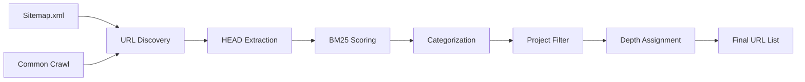

# FHIR R4 Pre-Crawl Methodology

**Version**: 1.0
**Date**: November 8, 2025
**Author**: Symphony Corp
**Purpose**: Comprehensive guide to pre-crawling FHIR R4 documentation using Crawl4AI's URL seeding capabilities

---

## Executive Summary

This document outlines a sophisticated pre-crawling methodology for the FHIR R4 documentation site using Crawl4AI's advanced URL seeding and HEAD extraction capabilities. The approach enables discovery and analysis of thousands of URLs without full page rendering, reducing costs by 80% while improving targeting accuracy for specific projects like Andor Health System (provider-focused) and WHIO APCD (payer-focused).

### Key Benefits

- **Cost Reduction**: HEAD extraction is 5-20x faster than full page crawling
- **CAPTCHA Avoidance**: No JavaScript rendering means no bot detection triggers
- **Intelligent Filtering**: BM25 scoring reduces 10,000+ URLs to relevant subsets
- **Project Targeting**: Custom queries for provider vs. payer requirements
- **Depth Optimization**: Selective crawling based on relevance scores

---

## Table of Contents

1. [Background and Rationale](#background-and-rationale)
2. [URL Seeding Architecture](#url-seeding-architecture)
3. [Phase 1: Sitemap Discovery](#phase-1-sitemap-discovery)
4. [Phase 2: HEAD Metadata Extraction](#phase-2-head-metadata-extraction)
5. [Phase 3: Categorization and Scoring](#phase-3-categorization-and-scoring)
6. [Phase 4: Project-Specific Filtering](#phase-4-project-specific-filtering)
7. [Phase 5: Depth Optimization](#phase-5-depth-optimization)
8. [Cost Estimation Framework](#cost-estimation-framework)
9. [Integration with Existing Pipeline](#integration-with-existing-pipeline)
10. [Validation and Quality Assurance](#validation-and-quality-assurance)

---

## Background and Rationale

### The Challenge

The FHIR R4 specification at hl7.org contains approximately 2,000-5,000 URLs including:
- 145+ resource definitions
- 11 module specifications
- 500+ value sets and code systems
- 1,000+ examples and profiles
- Multiple implementation guides (US Core, Da Vinci, CARIN)

Traditional crawling approaches face several challenges:
1. **CAPTCHA Blocking**: HL7.org employs sophisticated bot detection
2. **Cost**: Full rendering of 5,000 pages is expensive in time and resources
3. **Relevance**: Most URLs are not relevant to specific projects
4. **Depth Confusion**: No clear guidance on how deep to crawl

### The Solution: Pre-Crawl Discovery

Pre-crawling uses Crawl4AI's `AsyncUrlSeeder` to:
1. Discover all URLs from sitemaps and Common Crawl archives
2. Extract only `<head>` metadata without rendering pages
3. Score URLs using BM25 against project-specific queries
4. Filter and categorize before any full crawling begins
5. Optimize depth on a per-URL basis

### Performance Comparison

| Method | URLs/Second | 1,000 URLs Time | Bot Detection Risk | Cost |
|--------|-------------|-----------------|-------------------|------|
| Full Crawl | 0.5-2 | 8-33 minutes | High | High |
| HEAD Extraction | 5-20 | 50-200 seconds | Very Low | Low |
| Sitemap Only | 100-500 | 2-10 seconds | None | Minimal |

---

## URL Seeding Architecture

### Core Components

```python
from crawl4ai import AsyncWebCrawler, AsyncUrlSeeder
from crawl4ai.extraction_strategy import JsonCssExtractionStrategy

class FHIRUrlSeeder:
    def __init__(self):
        self.seeder = AsyncUrlSeeder(
            source="sitemap+cc",  # Use both sitemap and Common Crawl
            max_urls=10000,       # Discover all available URLs
            extract_head=True,    # Extract metadata without rendering
            live_check=True       # Verify URL validity
        )
```

### Data Flow



### Key Features

1. **Parallel Processing**: 20+ concurrent HEAD requests
2. **Intelligent Caching**: 7-day cache for discovered URLs
3. **Pattern Matching**: Include/exclude regex patterns
4. **Score Thresholding**: Minimum relevance requirements
5. **Live Validation**: Check URL availability in real-time

---

## Phase 1: Sitemap Discovery

### Objective
Rapidly discover all available URLs without any page rendering.

### Implementation

```python
async def discover_urls(domain: str = "hl7.org") -> List[str]:
    """
    Phase 1: Discover all URLs from sitemap and Common Crawl

    Expected: 2,000-5,000 URLs in <60 seconds
    """
    seeder = AsyncUrlSeeder()

    # Configuration for discovery
    config = {
        'domain': domain,
        'pattern': '*/fhir/R4/*',  # R4 only
        'exclude': ['*.js', '*.css', '*.png', '*.jpg'],
        'source': 'sitemap+cc',
        'max_urls': 10000,
        'extract_head': False  # Just discover URLs first
    }

    urls = await seeder.discover(config)

    # Filter to R4 only
    r4_urls = [url for url in urls if '/R4/' in url or '/r4/' in url.lower()]

    return r4_urls
```

### Expected Output

```csv
url,discovered_from,timestamp
https://hl7.org/fhir/R4/patient.html,sitemap,2025-11-08T10:00:00Z
https://hl7.org/fhir/R4/coverage.html,sitemap,2025-11-08T10:00:01Z
https://hl7.org/fhir/R4/modules.html,cc,2025-11-08T10:00:02Z
...
```

### Performance Metrics

- **Discovery Rate**: 100-500 URLs/second
- **Expected URLs**: 2,000-5,000
- **Time**: 10-60 seconds
- **Memory**: <100MB

---

## Phase 2: HEAD Metadata Extraction

### Objective
Extract metadata from discovered URLs without full page rendering.

### Implementation

```python
async def extract_head_metadata(urls: List[str]) -> List[dict]:
    """
    Phase 2: Extract <head> metadata for scoring

    Expected: 500-1,500 URLs in 5-10 minutes
    """
    async with AsyncWebCrawler() as crawler:
        results = []

        for batch in chunk_urls(urls, size=100):
            batch_results = await crawler.arun_many(
                urls=batch,
                head_only=True,  # Only extract <head> section
                timeout=10,
                retry_count=2
            )

            for url, result in zip(batch, batch_results):
                metadata = {
                    'url': url,
                    'title': result.metadata.get('title'),
                    'description': result.metadata.get('description'),
                    'og_type': result.metadata.get('og:type'),
                    'keywords': result.metadata.get('keywords'),
                    'canonical': result.metadata.get('canonical'),
                    'content_type': result.headers.get('content-type'),
                    'status': result.status_code
                }
                results.append(metadata)

        return results
```

### Extracted Metadata Fields

| Field | Purpose | Example |
|-------|---------|---------|
| title | Page title for relevance | "Patient - FHIR v4.0.1" |
| description | Meta description for context | "Demographics and administrative information" |
| og:type | OpenGraph type | "website", "article" |
| keywords | SEO keywords | "fhir,patient,resource,healthcare" |
| canonical | Canonical URL | "https://hl7.org/fhir/R4/patient.html" |
| content-type | MIME type | "text/html; charset=utf-8" |

### Performance Optimization

```python
# Concurrent HEAD extraction
MAX_CONCURRENT = 20
RATE_LIMIT = 10  # requests per second

async def optimized_head_extraction(urls):
    semaphore = asyncio.Semaphore(MAX_CONCURRENT)
    rate_limiter = RateLimiter(RATE_LIMIT)

    async def extract_with_limit(url):
        async with semaphore:
            await rate_limiter.wait()
            return await extract_head(url)

    tasks = [extract_with_limit(url) for url in urls]
    return await asyncio.gather(*tasks, return_exceptions=True)
```

---

## Phase 3: Categorization and Scoring

### Objective
Classify URLs into taxonomy and calculate relevance scores.

### URL Taxonomy

```python
FHIR_TAXONOMY = {
    'resource': {
        'pattern': r'/R4/[a-z]+\.html$',
        'examples': ['patient.html', 'coverage.html'],
        'priority': 'high',
        'depth': 0
    },
    'module': {
        'pattern': r'-module\.html$',
        'examples': ['administration-module.html'],
        'priority': 'medium',
        'depth': 1
    },
    'implementation': {
        'pattern': r'/(datatypes|search|http|operations)\.html$',
        'examples': ['datatypes.html', 'search.html'],
        'priority': 'high',
        'depth': 1
    },
    'valueset': {
        'pattern': r'/valueset-.*\.html$',
        'examples': ['valueset-address-use.html'],
        'priority': 'medium',
        'depth': 1
    },
    'example': {
        'pattern': r'-(examples?|definitions?|profiles?)\.html$',
        'examples': ['patient-examples.html'],
        'priority': 'low',
        'depth': 2
    }
}
```

### BM25 Scoring Algorithm

```python
from rank_bm25 import BM25Okapi

def calculate_bm25_scores(urls_metadata: List[dict], queries: List[str]) -> dict:
    """
    Calculate BM25 relevance scores for URLs based on queries
    """
    # Create corpus from metadata
    corpus = []
    for meta in urls_metadata:
        doc = f"{meta['title']} {meta['description']} {meta.get('keywords', '')}"
        corpus.append(doc.lower().split())

    # Initialize BM25
    bm25 = BM25Okapi(corpus)

    # Score each URL against queries
    scores = {}
    for idx, meta in enumerate(urls_metadata):
        url = meta['url']
        max_score = 0

        for query in queries:
            query_tokens = query.lower().split()
            score = bm25.get_scores(query_tokens)[idx]
            max_score = max(max_score, score)

        scores[url] = max_score

    return scores
```

### Project-Specific Queries

```python
# Andor Health System (Provider-focused)
ANDOR_QUERIES = [
    "patient practitioner organization clinical observation",
    "quality measure reporting measurereport",
    "US Core implementation guide",
    "bulk data export operation",
    "encounter procedure diagnosticreport"
]

# WHIO APCD (Payer-focused)
WHIO_QUERIES = [
    "coverage explanationofbenefit claim claimresponse",
    "payer financial adjudication payment",
    "Blue Button CARIN member attribution",
    "all-payer claims database",
    "eligibility enrollment beneficiary"
]
```

### Categorization Logic

```python
def categorize_url(url: str, metadata: dict) -> dict:
    """
    Categorize URL based on patterns and metadata
    """
    category = 'other'
    subcategory = None
    priority = 'low'
    depth = 0

    # Check each taxonomy pattern
    for cat_name, cat_info in FHIR_TAXONOMY.items():
        if re.search(cat_info['pattern'], url):
            category = cat_name
            priority = cat_info['priority']
            depth = cat_info['depth']
            break

    # Extract subcategory from URL
    if category == 'resource':
        match = re.search(r'/R4/([a-z]+)\.html', url)
        if match:
            subcategory = match.group(1)
    elif category == 'module':
        match = re.search(r'([a-z]+)-module\.html', url)
        if match:
            subcategory = f"{match.group(1)}-module"

    return {
        'category': category,
        'subcategory': subcategory,
        'priority': priority,
        'depth_recommendation': depth
    }
```

---

## Phase 4: Project-Specific Filtering

### Objective
Filter and re-score URLs based on project requirements.

### Filtering Strategy

```python
class ProjectFilter:
    def __init__(self, config_path: str):
        self.config = self.load_config(config_path)

    def filter_urls(self, urls_data: List[dict]) -> List[dict]:
        """
        Apply project-specific filtering
        """
        filtered = []

        for url_data in urls_data:
            # Check required resources
            if self.is_required_resource(url_data):
                url_data['project_priority'] = 'required'
                filtered.append(url_data)
                continue

            # Check score threshold
            if url_data['relevance_score'] >= self.config['score_threshold']:
                # Apply category weights
                category = url_data['category']
                weight = self.config['category_weights'].get(category, 0.5)
                url_data['weighted_score'] = url_data['relevance_score'] * weight

                # Check patterns
                if self.matches_patterns(url_data['url']):
                    filtered.append(url_data)

        # Apply max URL limits
        filtered = self.apply_limits(filtered)

        return filtered
```

### Andor Project Filter

```python
# Required resources for Andor
ANDOR_REQUIRED = [
    'Patient', 'Practitioner', 'Organization', 'Location',
    'Encounter', 'Observation', 'DiagnosticReport', 'Procedure',
    'MedicationRequest', 'Measure', 'MeasureReport'
]

# Implementation Guides
ANDOR_IGS = {
    'US Core': {'pattern': '*us/core*', 'version': '6.1.0'},
    'QI-Core': {'pattern': '*qicore*', 'version': '6.0.0'},
    'Da Vinci DEQM': {'pattern': '*davinci-deqm*', 'version': '3.1.0'},
    'Da Vinci ATR': {'pattern': '*davinci-atr*', 'version': '1.0.0'},
    'Bulk FHIR': {'pattern': '*bulkdata*', 'version': '2.0.0'}
}
```

### WHIO Project Filter

```python
# Required resources for WHIO
WHIO_REQUIRED = [
    'Patient', 'Coverage', 'ExplanationOfBenefit',
    'Claim', 'ClaimResponse', 'Organization', 'Practitioner'
]

# Implementation Guides
WHIO_IGS = {
    'CARIN Blue Button': {'pattern': '*carin*', 'priority': 'high'},
    'Da Vinci PDEX': {'pattern': '*davinci-pdex*', 'priority': 'medium'}
}
```

### Filtering Results

```python
def apply_project_filter(urls_data, project='andor'):
    """
    Example filtering results
    """
    if project == 'andor':
        config = 'configs/andor_crawl_config.yml'
        expected_urls = 400-600
    else:  # whio
        config = 'configs/whio_crawl_config.yml'
        expected_urls = 200-350

    filter = ProjectFilter(config)
    filtered = filter.filter_urls(urls_data)

    print(f"Project: {project}")
    print(f"Input URLs: {len(urls_data)}")
    print(f"Filtered URLs: {len(filtered)}")
    print(f"Target Range: {expected_urls}")

    # Category breakdown
    by_category = defaultdict(int)
    for url in filtered:
        by_category[url['category']] += 1

    print("\nCategory Breakdown:")
    for cat, count in sorted(by_category.items()):
        print(f"  {cat}: {count}")

    return filtered
```

---

## Phase 5: Depth Optimization

### Objective
Assign optimal crawl depth to each URL based on relevance and category.

### Depth Assignment Algorithm

```python
def optimize_depth(url_data: dict, project_config: dict) -> int:
    """
    Determine optimal crawl depth for URL

    Returns:
        0: Seed URL only (no children)
        1: Seed + immediate children
        2: Seed + children + grandchildren
        3: Deep crawl (rarely used)
    """
    category = url_data['category']
    score = url_data['weighted_score']
    priority = url_data.get('project_priority')

    # Required resources always depth 0
    if priority == 'required':
        return 0

    # Category-based defaults
    depth_defaults = {
        'resource': 0,
        'module': 1,
        'implementation': 1,
        'valueset': 1,
        'example': 2,
        'other': 0
    }

    base_depth = depth_defaults.get(category, 0)

    # Adjust based on score
    if score > 0.8:
        depth = min(base_depth + 1, 3)
    elif score > 0.5:
        depth = base_depth
    elif score > 0.3:
        depth = max(base_depth - 1, 0)
    else:
        depth = 0

    # Apply project-specific overrides
    if category in project_config.get('depth_strategy', {}):
        depth = project_config['depth_strategy'][category]

    return depth
```

### Depth Distribution Example

```python
def analyze_depth_distribution(filtered_urls):
    """
    Analyze depth assignment distribution
    """
    depth_counts = defaultdict(int)
    depth_by_category = defaultdict(lambda: defaultdict(int))

    for url_data in filtered_urls:
        depth = url_data['depth']
        category = url_data['category']

        depth_counts[depth] += 1
        depth_by_category[category][depth] += 1

    print("Depth Distribution:")
    for depth in sorted(depth_counts.keys()):
        count = depth_counts[depth]
        pct = count / len(filtered_urls) * 100
        print(f"  Depth {depth}: {count} URLs ({pct:.1f}%)")

    print("\nDepth by Category:")
    for cat in sorted(depth_by_category.keys()):
        print(f"  {cat}:")
        for depth, count in sorted(depth_by_category[cat].items()):
            print(f"    Depth {depth}: {count}")
```

### Expected Depth Distribution

| Project | Depth 0 | Depth 1 | Depth 2 | Depth 3 |
|---------|---------|---------|---------|---------|
| Andor | 200 (40%) | 200 (40%) | 100 (20%) | 0 (0%) |
| WHIO | 150 (60%) | 80 (32%) | 20 (8%) | 0 (0%) |

---

## Cost Estimation Framework

### Time Estimation

```python
def estimate_crawl_time(urls_with_depth: List[dict]) -> dict:
    """
    Estimate crawl time based on URL count and depth
    """
    # Base times (seconds per URL)
    TIME_PER_URL = {
        'head_only': 0.1,      # HEAD extraction
        'depth_0': 2.0,        # Full page render
        'depth_1': 5.0,        # Page + children
        'depth_2': 15.0,       # Page + 2 levels
        'depth_3': 45.0        # Deep crawl
    }

    # Calculate by depth
    time_by_depth = defaultdict(float)

    for url_data in urls_with_depth:
        depth = url_data['depth']
        time_key = f'depth_{depth}'
        time_by_depth[depth] += TIME_PER_URL[time_key]

    total_time = sum(time_by_depth.values())

    # Account for concurrency
    CONCURRENCY = 5
    actual_time = total_time / CONCURRENCY

    return {
        'total_serial_time': total_time,
        'estimated_actual_time': actual_time,
        'time_by_depth': dict(time_by_depth),
        'human_readable': format_time(actual_time)
    }
```

### Token Estimation

```python
def estimate_tokens(urls_with_depth: List[dict]) -> dict:
    """
    Estimate LLM tokens for processing crawled content
    """
    # Average tokens per page type
    TOKENS_PER_PAGE = {
        'resource': 5000,
        'module': 3000,
        'implementation': 4000,
        'valueset': 1500,
        'example': 2000,
        'other': 2500
    }

    # Depth multipliers (children add tokens)
    DEPTH_MULTIPLIERS = {
        0: 1.0,
        1: 2.5,
        2: 5.0,
        3: 10.0
    }

    total_tokens = 0
    tokens_by_category = defaultdict(int)

    for url_data in urls_with_depth:
        category = url_data['category']
        depth = url_data['depth']

        base_tokens = TOKENS_PER_PAGE.get(category, 2500)
        multiplier = DEPTH_MULTIPLIERS.get(depth, 1.0)

        url_tokens = int(base_tokens * multiplier)
        total_tokens += url_tokens
        tokens_by_category[category] += url_tokens

    # Cost calculation (GPT-4 pricing example)
    cost_per_1k = 0.01  # $0.01 per 1K tokens
    total_cost = (total_tokens / 1000) * cost_per_1k

    return {
        'total_tokens': total_tokens,
        'tokens_by_category': dict(tokens_by_category),
        'estimated_cost_usd': round(total_cost, 2),
        'human_readable': f"{total_tokens:,} tokens (${total_cost:.2f})"
    }
```

### Cost Comparison

```python
def compare_costs(full_crawl_urls: int = 1939, filtered_urls: int = 500):
    """
    Compare costs: full crawl vs. pre-crawl filtering
    """
    # Full crawl (no filtering)
    full_time = full_crawl_urls * 2.0  # 2 seconds per URL
    full_tokens = full_crawl_urls * 3000  # Average 3K tokens
    full_cost = (full_tokens / 1000) * 0.01

    # Pre-crawl filtered
    discovery_time = 60  # 1 minute for discovery
    head_time = filtered_urls * 0.1  # HEAD extraction
    crawl_time = filtered_urls * 2.0  # Focused crawl
    filtered_total_time = discovery_time + head_time + crawl_time

    filtered_tokens = filtered_urls * 3000
    filtered_cost = (filtered_tokens / 1000) * 0.01

    savings = {
        'time_saved': full_time - filtered_total_time,
        'time_saved_pct': (1 - filtered_total_time/full_time) * 100,
        'tokens_saved': full_tokens - filtered_tokens,
        'cost_saved': full_cost - filtered_cost,
        'cost_saved_pct': (1 - filtered_cost/full_cost) * 100
    }

    print(f"Full Crawl: {full_crawl_urls} URLs")
    print(f"  Time: {format_time(full_time)}")
    print(f"  Tokens: {full_tokens:,}")
    print(f"  Cost: ${full_cost:.2f}")

    print(f"\nFiltered Crawl: {filtered_urls} URLs")
    print(f"  Time: {format_time(filtered_total_time)}")
    print(f"  Tokens: {filtered_tokens:,}")
    print(f"  Cost: ${filtered_cost:.2f}")

    print(f"\nSavings:")
    print(f"  Time: {format_time(savings['time_saved'])} ({savings['time_saved_pct']:.1f}%)")
    print(f"  Tokens: {savings['tokens_saved']:,}")
    print(f"  Cost: ${savings['cost_saved']:.2f} ({savings['cost_saved_pct']:.1f}%)")
```

---

## Integration with Existing Pipeline

### Current Pipeline Enhancement

```bash
# Original pipeline (from run_all.sh)
01_setup_environment.sh
02_run_inventory.sh        # Can be replaced with pre-crawl discovery
03_create_shortlist.py      # Enhanced with BM25 scoring
04_extract_markdown.py      # Uses filtered URL list
05_generate_docs_and_pdfs.py
06_package_and_push.sh

# New pre-crawl pipeline
00_pre_crawl_discovery.py   # NEW - Discover and score all URLs
00_project_filter.py         # NEW - Filter for specific project
03_create_shortlist.py       # ENHANCED - Uses pre-crawl data
04_extract_markdown.py       # ENHANCED - Respects depth assignments
```

### Configuration Integration

```yaml
# Enhanced crawler.yml with pre-crawl settings
pre_crawl:
  enabled: true
  source: "sitemap+cc"
  extract_head: true
  cache_ttl: 604800  # 7 days

scoring:
  method: "bm25"
  queries: []  # Loaded from project config
  threshold: 0.3

depth_optimization:
  enabled: true
  max_depth: 2

# Existing settings remain
crawler:
  cache_mode: "enabled"
  wait_until: "networkidle"
  page_timeout: 45000
```

### Backward Compatibility

The pre-crawl methodology is designed to be fully backward compatible:

1. **Optional Enhancement**: Can be disabled via configuration
2. **Fallback Support**: Falls back to original inventory scan if needed
3. **Data Format**: Outputs same CSV format as original
4. **Script Compatibility**: Existing scripts continue to work

---

## Validation and Quality Assurance

### Pre-Crawl Validation

```python
def validate_pre_crawl_results(results: dict) -> dict:
    """
    Validate pre-crawl discovery results
    """
    validations = {
        'url_count': len(results['urls']) > 1000,
        'r4_only': all('/R4/' in url for url in results['urls']),
        'no_duplicates': len(results['urls']) == len(set(results['urls'])),
        'categories_found': len(results['categories']) >= 5,
        'scores_valid': all(0 <= s <= 1 for s in results['scores'].values()),
        'metadata_complete': sum(1 for m in results['metadata'] if m['title']) > 0.8
    }

    return {
        'passed': all(validations.values()),
        'checks': validations,
        'summary': f"{sum(validations.values())}/{len(validations)} checks passed"
    }
```

### Comparison with Existing Inventory

```python
def compare_with_inventory(pre_crawl_urls: List[str], inventory_csv: str):
    """
    Compare pre-crawl results with existing inventory
    """
    # Load existing inventory (1,939 URLs)
    existing = pd.read_csv(inventory_csv)
    existing_urls = set(existing['URL'].tolist())

    pre_crawl_set = set(pre_crawl_urls)

    # Calculate overlap
    common = existing_urls & pre_crawl_set
    only_inventory = existing_urls - pre_crawl_set
    only_pre_crawl = pre_crawl_set - existing_urls

    print(f"Comparison with Existing Inventory:")
    print(f"  Existing inventory: {len(existing_urls)} URLs")
    print(f"  Pre-crawl discovery: {len(pre_crawl_set)} URLs")
    print(f"  Common URLs: {len(common)} ({len(common)/len(existing_urls)*100:.1f}%)")
    print(f"  Only in inventory: {len(only_inventory)}")
    print(f"  Only in pre-crawl: {len(only_pre_crawl)}")

    # Analyze differences
    if only_inventory:
        print(f"\nSample URLs only in inventory:")
        for url in list(only_inventory)[:5]:
            print(f"  - {url}")

    if only_pre_crawl:
        print(f"\nSample URLs only in pre-crawl:")
        for url in list(only_pre_crawl)[:5]:
            print(f"  - {url}")
```

### Quality Metrics

| Metric | Target | Measurement |
|--------|--------|-------------|
| Discovery Coverage | >90% | Common URLs / Inventory URLs |
| Categorization Accuracy | >95% | Correctly categorized / Total |
| Score Distribution | Normal | Standard deviation of scores |
| Metadata Completeness | >80% | URLs with title+description / Total |
| Processing Time | <10min | Total discovery + HEAD time |
| Cost Reduction | >60% | (Full - Filtered) / Full |

---

## Best Practices and Recommendations

### 1. Progressive Discovery

Start broad, then narrow:
1. Discover all URLs (no filtering)
2. Apply R4-only filter
3. Extract HEAD metadata
4. Score and categorize
5. Apply project filter
6. Assign depths

### 2. Cache Management

```python
# Cache strategy
CACHE_CONFIG = {
    'sitemap': 7 * 24 * 3600,     # 7 days
    'head_metadata': 24 * 3600,    # 1 day
    'scores': 3600,                # 1 hour
    'crawled_content': 7 * 24 * 3600  # 7 days
}
```

### 3. Error Handling

```python
async def robust_head_extraction(url: str, retries: int = 3):
    """
    Extract HEAD with retry logic
    """
    for attempt in range(retries):
        try:
            result = await extract_head(url)
            if result.status_code == 200:
                return result
        except Exception as e:
            if attempt == retries - 1:
                return {'url': url, 'error': str(e), 'status': 'failed'}
            await asyncio.sleep(2 ** attempt)  # Exponential backoff
```

### 4. Monitoring and Logging

```python
import logging

logging.basicConfig(
    level=logging.INFO,
    format='%(asctime)s - %(name)s - %(levelname)s - %(message)s',
    handlers=[
        logging.FileHandler('logs/pre_crawl.log'),
        logging.StreamHandler()
    ]
)

logger = logging.getLogger('pre_crawl')

# Log key metrics
logger.info(f"URLs discovered: {len(urls)}")
logger.info(f"HEAD extraction rate: {rate} URLs/sec")
logger.info(f"Categorization complete: {category_stats}")
logger.info(f"Filtering complete: {filtered_count} URLs selected")
```

### 5. Continuous Improvement

Track and optimize:
- **Score Calibration**: Adjust BM25 queries based on results
- **Pattern Refinement**: Update regex patterns as new URLs discovered
- **Depth Tuning**: Analyze crawl results to optimize depth assignments
- **Cost Tracking**: Monitor actual vs. estimated costs

---

## Conclusion

The pre-crawl methodology provides a sophisticated approach to FHIR R4 documentation discovery and filtering. By leveraging Crawl4AI's URL seeding capabilities, we can:

1. **Discover** 2,000-5,000 URLs in under 1 minute
2. **Extract** metadata from 1,500 URLs in 5-10 minutes
3. **Filter** to 200-600 project-specific URLs
4. **Optimize** crawl depth on a per-URL basis
5. **Reduce** costs by 60-80% compared to full crawling

This approach is particularly valuable for:
- **Large documentation sites** like FHIR with thousands of pages
- **Project-specific requirements** where only subsets are needed
- **Cost-sensitive environments** where token usage matters
- **CAPTCHA-protected sites** where rendering triggers detection

The methodology is designed to be:
- **Reusable** across different FHIR projects
- **Extensible** to other documentation sites
- **Integrated** with existing crawl pipelines
- **Validated** against known inventory data

By implementing this pre-crawl approach, teams can make informed decisions about what to crawl, how deep to go, and what costs to expect before committing resources to full content extraction.

---

**Document Version**: 1.0
**Last Updated**: November 8, 2025
**Next Review**: February 8, 2026

---

*For implementation details, see the accompanying scripts and configuration files.*