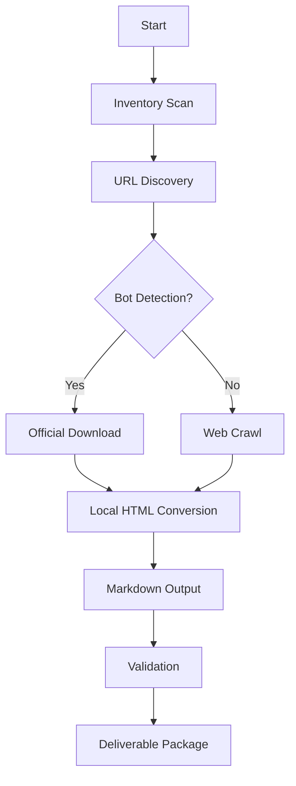

# FHIR R4 Crawler - Complete Knowledge Transfer Guide

**Version**: 1.0
**Date**: November 8, 2025
**Purpose**: Comprehensive knowledge transfer for FHIR R4 documentation extraction system
**Target Audience**: Developers, Maintainers, Operations Teams

---

## Table of Contents

1. [Project Overview](#project-overview)
2. [Architecture & Design](#architecture--design)
3. [Setup & Installation](#setup--installation)
4. [Core Components](#core-components)
5. [Workflow & Operations](#workflow--operations)
6. [Troubleshooting Guide](#troubleshooting-guide)
7. [Maintenance & Updates](#maintenance--updates)
8. [Knowledge Transfer Checklist](#knowledge-transfer-checklist)
9. [Contact & Support](#contact--support)

---

## Project Overview

### What This Project Does

The FHIR R4 Crawler is a sophisticated documentation extraction system that:
- **Crawls and extracts** FHIR R4 documentation from HL7.org
- **Converts HTML to Markdown** for LLM consumption
- **Handles bot detection** using a hybrid approach
- **Produces validated deliverables** with comprehensive quality checks

### Business Context

**Problem Solved**: Healthcare organizations need structured access to FHIR R4 documentation for:
- Training Large Language Models on healthcare standards
- Creating searchable documentation repositories
- Building automated documentation systems
- Generating API references and guides

**Key Stakeholders**:
- Healthcare technology teams
- Documentation engineers
- LLM developers
- API integration teams

### Technical Stack

```yaml
Core Technologies:
  - Python 3.11+
  - Crawl4AI 0.7.6 (web crawling with anti-detection)
  - Playwright (browser automation)
  - BeautifulSoup4 (HTML parsing)
  - Pandas (data processing)

Optional Components:
  - WeasyPrint (PDF generation)
  - Google Generative AI (agent support)
  - CrewAI (multi-agent orchestration)
```

---

## Architecture & Design

### System Architecture



### Directory Structure

```
fhir-r4-crawl/
├── 00_DOCUMENTATION/          # Project documentation
│   ├── README.md              # Overview and methodology
│   ├── PROVENANCE.md          # Execution trace
│   └── EXTRACTION_METHODOLOGY.md
│
├── 01_INPUTS_VALIDATED/       # Source data
│   ├── inventory/             # Site scan results
│   └── shortlist/             # Target URLs
│
├── 02_CONFIGURATION/          # Configurations
│   ├── browser.yml            # Browser settings
│   └── crawler.yml            # Crawler parameters
│
├── 03_OUTPUTS_COMPLETE/       # Final outputs
│   └── markdown_rebuilt/      # Validated markdowns
│
├── 04_VALIDATION_REPORTS/     # QA documentation
│   └── COMPREHENSIVE_VALIDATION_REPORT.md
│
├── scripts/                   # Automation pipeline
│   ├── 01_setup_environment.sh
│   ├── 02_run_inventory.sh
│   ├── 03_create_shortlist.py
│   ├── 04_extract_markdown.py
│   └── 10_rebuild_markdown_from_local.py
│
└── FHIR_R4_DELIVERABLE/      # Production package
```

### Design Decisions

1. **Numbered Folder Methodology**: Provides immediate scope visibility and execution order
2. **Hybrid Extraction Approach**: Combines web crawling with official downloads to overcome bot detection
3. **YAML Frontmatter**: Each markdown file includes metadata for traceability
4. **Validation-First**: Comprehensive quality checks before delivery

---

## Setup & Installation

### Prerequisites

```bash
# System Requirements
- Python 3.11 or higher
- 4GB RAM minimum
- 10GB free disk space
- Internet connection

# Operating Systems
- macOS 10.15+
- Ubuntu 20.04+
- Windows 10+ with WSL2
```

### Initial Setup

#### Step 1: Clone Repository

```bash
git clone https://github.com/siva-k85/fhir-r4-crawl.git
cd fhir-r4-crawl
```

#### Step 2: Create Virtual Environment

```bash
python3 -m venv .venv-fhir
source .venv-fhir/bin/activate  # On Windows: .venv-fhir\Scripts\activate
```

#### Step 3: Install Dependencies

```bash
pip install --upgrade pip
pip install -r requirements.txt

# Install Playwright browsers
playwright install chromium
```

#### Step 4: Configure Environment

```bash
# Create .env file (if using API keys)
cat > .env << EOF
GEMINI_API_KEY=your_api_key_here  # Optional for AI agent
FIRECRAWL_API_KEY=your_key_here   # Optional for cross-validation
EOF
```

### Quick Verification

```bash
# Test basic functionality
python -c "import crawl4ai; print(f'Crawl4AI version: {crawl4ai.__version__}')"

# Verify browser automation
python -c "from playwright.sync_api import sync_playwright; print('Playwright ready')"
```

---

## Core Components

### 1. Inventory Scanner (`scripts/02_run_inventory.sh`)

**Purpose**: Discovers all available URLs on HL7 FHIR R4 site

```python
# Key configuration
max_depth = 1          # Respect server resources
max_pages = 400       # Limit scan scope
timeout = 45000       # 45 seconds per page
```

**Output**: `01_INPUTS_VALIDATED/inventory/links.csv`

### 2. Shortlist Creator (`scripts/03_create_shortlist.py`)

**Purpose**: Identifies payer-focused resources for extraction

**Selection Criteria**:
- Administrative resources (Patient, Coverage)
- Financial resources (ExplanationOfBenefit)
- Foundation resources (StructureDefinition)
- Clinical resources (Provenance)

### 3. Markdown Extractor (`scripts/04_extract_markdown.py`)

**Core Logic**:
```python
async def extract_page(url: str) -> dict:
    """
    Extract markdown from URL with anti-detection

    Returns:
        dict: {
            'url': str,
            'title': str,
            'markdown': str,
            'metadata': dict
        }
    """
    # Anti-detection measures
    config = BrowserConfig(
        user_agent="Mozilla/5.0...",
        simulate_user=True,
        override_navigator=True,
        magic=True  # Comprehensive anti-detection
    )

    # Extraction with retries
    result = await crawler.arun(
        url=url,
        cache_mode="bypass",
        wait_until="networkidle"
    )

    return process_markdown(result)
```

### 4. Local HTML Converter (`scripts/10_rebuild_markdown_from_local.py`)

**Purpose**: Converts official downloaded HTML to markdown when web crawl fails

**Key Features**:
- Processes local HTML files from `fhir-spec.zip`
- Maintains URL mapping for consistency
- Preserves metadata and structure

### 5. Validation Pipeline

**Components**:
- Content validation (no CAPTCHA pages)
- Size validation (10KB minimum)
- Encoding validation (UTF-8)
- Metadata validation (YAML frontmatter)
- Version purity (R4 only, no R5/R4B)

---

## Workflow & Operations

### Standard Extraction Workflow

#### 1. Full Pipeline Execution

```bash
# Run complete pipeline
./scripts/run_all.sh

# Or step-by-step
./scripts/01_setup_environment.sh
./scripts/02_run_inventory.sh
python scripts/03_create_shortlist.py
python scripts/04_extract_markdown.py
python scripts/05_generate_docs_and_pdfs.py
./scripts/06_package_and_push.sh
```

#### 2. Targeted Extraction

```bash
# Extract specific page
python scripts/04_extract_markdown.py --url "https://hl7.org/fhir/R4/patient.html"

# Extract from shortlist only
python scripts/04_extract_markdown.py --shortlist-only
```

#### 3. Rebuild from Local Mirror

```bash
# When web crawl is blocked
# 1. Download official spec
wget https://hl7.org/fhir/R4/fhir-spec.zip

# 2. Extract to local mirror
unzip fhir-spec.zip -d 02_CONFIGURATION/fhir_spec_mirror/

# 3. Rebuild markdown
python scripts/10_rebuild_markdown_from_local.py
```

### Monitoring & Logs

```bash
# View extraction logs
tail -f logs/extraction_$(date +%Y%m%d).log

# Check validation results
cat 04_VALIDATION_REPORTS/COMPREHENSIVE_VALIDATION_REPORT.md

# Monitor crawl progress
watch -n 1 "ls -la 03_OUTPUTS_COMPLETE/markdown/ | wc -l"
```

### Quality Assurance Workflow

1. **Pre-extraction Validation**
   - Verify URLs are R4-specific
   - Check server availability
   - Validate configuration

2. **During Extraction**
   - Monitor for CAPTCHA blocks
   - Track success/failure rates
   - Verify content quality

3. **Post-extraction Validation**
   ```bash
   # Run validation suite
   python scripts/validate_outputs.py

   # Check for issues
   grep -l "Let's confirm you are human" 03_OUTPUTS_COMPLETE/markdown/*.md
   ```

---

## Troubleshooting Guide

### Common Issues & Solutions

#### Issue 1: CAPTCHA Blocking

**Symptoms**:
- Extracted content contains "Let's confirm you are human"
- File sizes are suspiciously small (<10KB)
- Multiple pages have identical content

**Solution**:
```bash
# Switch to local mirror approach
python scripts/10_rebuild_markdown_from_local.py

# Or use different anti-detection config
export CRAWL_MODE="stealth"
python scripts/04_extract_markdown.py
```

#### Issue 2: Playwright Installation Fails

**Symptoms**:
- "Executable doesn't exist" errors
- Browser launch failures

**Solution**:
```bash
# Reinstall browsers
playwright install chromium --force
playwright install-deps  # Linux only

# Verify installation
python -c "from playwright.sync_api import sync_playwright; p = sync_playwright().start(); p.chromium.launch(headless=True); print('Success')"
```

#### Issue 3: Memory/Performance Issues

**Symptoms**:
- Process killed during extraction
- Slow extraction speeds

**Solution**:
```python
# Reduce concurrent workers in scripts/04_extract_markdown.py
MAX_WORKERS = 2  # Default is 5

# Increase page timeout
PAGE_TIMEOUT = 60000  # 60 seconds

# Enable caching for repeated runs
CACHE_MODE = "enabled"  # Instead of "bypass"
```

#### Issue 4: PDF Generation Errors

**Symptoms**:
- WeasyPrint CSS gradient errors
- Missing fonts warnings

**Solution**:
```bash
# Install system fonts (Ubuntu/Debian)
sudo apt-get install fonts-liberation

# Or skip PDF generation
python scripts/05_generate_docs_and_pdfs.py --skip-pdf

# Alternative: Use markdown-pdf
npm install -g markdown-pdf
markdown-pdf 03_OUTPUTS_COMPLETE/markdown/*.md
```

### Debugging Techniques

```python
# Enable debug logging
import logging
logging.basicConfig(level=logging.DEBUG)

# Add breakpoints in extraction
import pdb; pdb.set_trace()

# Capture network traffic
from playwright.sync_api import sync_playwright
browser = playwright.chromium.launch(args=['--enable-logging=stderr'])

# Save page screenshots on failure
page.screenshot(path=f"debug_{url.replace('/', '_')}.png")
```

---

## Maintenance & Updates

### Regular Maintenance Tasks

#### Weekly
- Check HL7.org for specification updates
- Review extraction success rates
- Clear cache if >5GB

#### Monthly
- Update dependencies: `pip install --upgrade -r requirements.txt`
- Review and archive old logs
- Validate all shortlist URLs still exist

#### Quarterly
- Full regression test of extraction pipeline
- Update anti-detection measures if needed
- Review and update documentation

### Updating the Crawler

#### Adding New URLs to Shortlist

```python
# Edit scripts/03_create_shortlist.py
PAYER_FOCUSED_RESOURCES = [
    # ... existing URLs ...
    "https://hl7.org/fhir/R4/new-resource.html",  # Add new URL
]
```

#### Modifying Anti-Detection Measures

```yaml
# Edit 02_CONFIGURATION/browser.yml
simulate_user: true
extra_flags:
  - "--disable-blink-features=AutomationControlled"
  - "--disable-dev-shm-usage"  # Add new flag
```

#### Upgrading Dependencies

```bash
# Test in isolated environment first
python -m venv .venv-test
source .venv-test/bin/activate
pip install --upgrade crawl4ai playwright beautifulsoup4

# Run test extraction
python scripts/04_extract_markdown.py --test-mode

# If successful, update requirements.txt
pip freeze > requirements_new.txt
```

### Version Control Best Practices

```bash
# Branch naming convention
git checkout -b feature/add-new-resource
git checkout -b fix/captcha-handling
git checkout -b update/dependencies-2025q1

# Commit message format
git commit -m "feat: Add support for new FHIR resources"
git commit -m "fix: Improve CAPTCHA detection logic"
git commit -m "docs: Update knowledge transfer guide"

# Tagging releases
git tag -a v1.1.0 -m "Release version 1.1.0 with improved bot detection"
git push origin v1.1.0
```

---

## Knowledge Transfer Checklist

### For New Team Members

- [ ] **Environment Setup**
  - [ ] Python 3.11+ installed
  - [ ] Virtual environment created
  - [ ] All dependencies installed
  - [ ] Playwright browsers installed
  - [ ] Test extraction successful

- [ ] **Documentation Review**
  - [ ] Read this knowledge transfer guide
  - [ ] Review 00_MANIFEST.md
  - [ ] Understand extraction methodology
  - [ ] Review validation reports

- [ ] **Hands-On Practice**
  - [ ] Run inventory scan on test site
  - [ ] Extract single page successfully
  - [ ] Handle CAPTCHA block scenario
  - [ ] Generate validation report

- [ ] **Code Understanding**
  - [ ] Review scripts 01-06 in sequence
  - [ ] Understand anti-detection measures
  - [ ] Know hybrid extraction approach
  - [ ] Can modify configurations

### For Operations Team

- [ ] **Deployment**
  - [ ] Server requirements verified
  - [ ] Cron jobs configured for regular runs
  - [ ] Monitoring alerts set up
  - [ ] Backup procedures documented

- [ ] **Monitoring**
  - [ ] Log rotation configured
  - [ ] Success metrics dashboard
  - [ ] Alert thresholds defined
  - [ ] Incident response procedures

### For Maintenance Team

- [ ] **Updates**
  - [ ] Dependency update process understood
  - [ ] Test environment available
  - [ ] Rollback procedures documented
  - [ ] Change management process

- [ ] **Troubleshooting**
  - [ ] Common issues documented
  - [ ] Debug tools available
  - [ ] Escalation paths defined
  - [ ] Root cause analysis process

---

## Contact & Support

### Internal Resources

```yaml
Repository: https://github.com/siva-k85/fhir-r4-crawl
Issues: https://github.com/siva-k85/fhir-r4-crawl/issues
Wiki: https://github.com/siva-k85/fhir-r4-crawl/wiki
```

### External Resources

```yaml
FHIR Documentation: https://hl7.org/fhir/R4/
Crawl4AI Docs: https://docs.crawl4ai.com/
Playwright Docs: https://playwright.dev/python/
```

### Team Contacts

```yaml
Project Lead: [Contact Information]
Technical Lead: [Contact Information]
Operations: [Contact Information]
```

### Escalation Matrix

| Issue Type | First Contact | Escalation | Timeline |
|------------|--------------|------------|----------|
| Extraction Failure | Operations Team | Technical Lead | 2 hours |
| CAPTCHA Blocking | Technical Lead | Project Lead | 4 hours |
| Data Quality | QA Team | Technical Lead | 24 hours |
| Infrastructure | Operations | DevOps Lead | 1 hour |

---

## Appendix A: Quick Reference Commands

```bash
# Setup
python3 -m venv .venv-fhir && source .venv-fhir/bin/activate
pip install -r requirements.txt

# Run extraction
python scripts/04_extract_markdown.py

# Validate outputs
grep -l "human" 03_OUTPUTS_COMPLETE/markdown/*.md

# Rebuild from local
python scripts/10_rebuild_markdown_from_local.py

# Package deliverable
./scripts/06_package_and_push.sh

# Clean up
rm -rf logs/*.log 03_OUTPUTS_COMPLETE/markdown_old/
```

---

## Appendix B: Configuration Templates

### Browser Configuration (browser.yml)
```yaml
headless: true
text_mode: false
user_agent: "Mozilla/5.0 (Macintosh; Intel Mac OS X 10_15_7) AppleWebKit/537.36"
simulate_user: true
override_navigator: true
magic: true
extra_headers:
  Accept: "text/html,application/xhtml+xml"
  Accept-Language: "en-US,en;q=0.9"
```

### Crawler Configuration (crawler.yml)
```yaml
cache_mode: "bypass"
wait_until: "networkidle"
page_timeout: 45000
max_depth: 1
word_count_threshold: 50
```

---

## Appendix C: Validation Criteria

| Check | Threshold | Action if Failed |
|-------|-----------|-----------------|
| File Size | > 10KB | Re-extract or use local mirror |
| CAPTCHA Detection | 0 occurrences | Switch to local mirror |
| UTF-8 Encoding | 100% valid | Fix encoding issues |
| YAML Frontmatter | Present in all | Add metadata headers |
| R4 Version | No R5/R4B content | Filter non-R4 content |
| Content Quality | Actual FHIR docs | Re-extract affected pages |

---

**Document Version**: 1.0
**Last Updated**: November 8, 2025
**Next Review**: February 8, 2026

---

*This knowledge transfer guide is a living document. Please submit updates and improvements via pull request.*